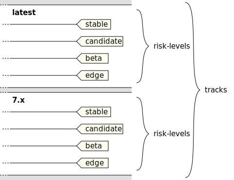
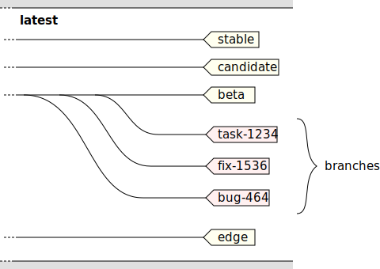

.. 551.md

.. _channels:

Channels
========

Channels are an important snap concept. They define which release of a snap is
installed and tracked for updates.

A channel consists of, and is subdivided by, tracks, risk-levels and branches:

* :ref:`channels-tracks` enable snap developers to publish multiple supported
  releases of their application under the same snap name.
* :ref:`channels-risk-levels` represent a progressive potential trade-off
  between stability and new features
* :ref:`channels-branches` are optional and hold temporary releases intended to
  help with bug-fixing.

The complete channel name can be structured as three distinct parts separated
by slashes:

.. code:: text

   <track>/<risk>/<branch>

The *tracking* value for an installed snap, as shown in the output from the
:command:`snap list` command, shows which channel is installed and is being
followed for that snap.

.. _channels-tracks:

Tracks
------

All snaps have a default track. Without the snap developer specifying otherwise,
the default track is called *latest*. Similarly, when no track is specified, a
snap will implicitly install from the *latest* track. The track can also be
specified explicitly:

.. code:: bash

   snap install vlc --channel=latest/edge

Developers can optionally choose whether to supplement the default *latest*
track with additional tracks. The developer is also free to designate one of
these as the default track to be installed when no further preference is given.

Microsoft's `Skype snap`_ is a good example of how tracks can be used.
It contains two tracks: the default *latest* track for the majority of users,
and an *insider* track for Microsoft's QA team and users interested in testing
the latest Skype developments ahead of a stable release.

Equally, a track could also be used to track minor updates (2.0.1, 2.0.2),
major updates (2.1, 2.2), or releases held for long-term support (3.2, 4.1).

Tracks are listed in the *channels* section of the output from the
:command:`snap info` command:

.. code:: bash

   $ snap info skype
   [...]
   channels:
     latest/stable:     8.99.0.403   2023-07-03 (287) 189MB -
     latest/candidate:  ↑
     latest/beta:       ↑
     latest/edge:       ↑
     insider/stable:    8.100.76.203 2023-07-24 (288) 189MB -
     insider/candidate: ↑
     insider/beta:      ↑
     insider/edge:      ↑
   [...]

In the above output, the Skype snap includes the custom *insider* track.
You can also see which tracks a snap supports by clicking *Other versions*
from its online `Snap Store`_ entry.

To install Skype from its *insider* track, for example, use the following
command:

.. code:: bash

   snap install skype --channel=insider/stable

A user who already has Skype installed can switch channel with the
:command:`snap refresh` command:

.. code:: bash

   snap refresh skype --channel=insider/stable

Alternatively, if using GNOME Software, select the ‘stable' channel in the
store page for Skype, and select a channel to switch to.

Developers must currently make a request for tracks to be added to their snap
via the `store-requests forum category`_. Releases are verified and checked to
ensure that reasonable user expectations are being met. For example, only
*3.2.\** versions are accepted into a *3.2* track.

.. _channels-risk-levels:

Risk-levels
-----------

There are four risk-levels: stable, candidate, beta and edge. These represent
decreasing levels of stability for a snap. Installing from a less stable
risk-level will typically mean that updates for a snap will be more frequent
than for a more stable risk-level.

The risk-levels have the following meaning:

**stable**
    For the vast majority of users running on production environments.

    Releases at this risk-level are as stable as they will ever get, according
    to the project's standards. Important software will only reach this stage
    once it is ready for production use and may be used in products. There is
    an implied promise to avoid any changes that would disrupt those usages.

**candidate**
    For users who need to test updates prior to stable deployment, or those
    verifying whether a specific issue has been resolved.

    Candidate releases are considered almost ready for going into stable, but
    need some additional real world experimentation before they move forward.
    Software reaching this stage will typically have passed all available QA
    and review processes, since users following it expect a high stability
    level. Should almost never break.

**beta**
    For users wanting to test the latest features, typically outside of a
    production environment.

    Beta is the first level towards the stabilisation of what was before a
    fast moving stream of changes. Specific projects may have slightly
    different terminology for such releases (alpha, beta, etc.) but all of
    these are welcome on this risk-level. These releases will almost certainly
    have passed some sort of review and QA, but may still have unfinished
    parts. Breaking changes are still relatively common here.

**edge**
    For users wanting to closely track development.

    Edge releases often include a moving stream of changes without QA or
    review promises and are typically built automatically by a CI process from
    an arbitrary source code snapshot. Often the CI will only publish after
    some sort of automatic QA passed, and code reviews remain a good practice,
    but these are project-specific. You should assume that edge releases may
    break often.

Snaps are installed using from the stable risk-level by default. For example,
the following command installs VLC from its stable channel:

.. code:: bash

   sudo snap install vlc

Use the ``--channel`` option to select a different risk-level. The following
command will install the latest beta snap of VLC:

.. code:: bash

   sudo snap install --channel=beta vlc

If the beta snap is not available, a snap will be installed from the closest
channel with a more stable risk-level.

.. note::
   For brevity, ``--stable``, ``--candidate``, ``--beta`` and ``--edge`` can
   be used instead of ``--channel=<risk-level>``

After installation, the risk-level being tracked can be changed with the use
of the ``switch`` command option:

.. code:: bash

   sudo snap switch --channel=stable vlc

This option will not automatically refresh the snap to force the installation
of a new snap. To switch channels and update the snap with a single command,
add the ``--channel`` option to the ``refresh`` command:

.. code:: bash

   sudo snap refresh --channel=stable vlc

To check which channel a snap is tracking, look for the *tracking* field in
the output from the :command:`snap info` command:

.. code:: bash

   $ snap info vlc
   [...]
   snap-id:      RT9mcUhVsRYrDLG8qnvGiy26NKvv6Qkd
   tracking:     edge
   refresh-date: yesterday at 19:54 BST
   [...]

Risk-levels may not match a project's internal conventions. Some projects may
use *alpha* instead of *edge*, for instance. However, a project's own release
nomenclature should be close enough to a snap's risk-levels to allow you to
judge the relative stability of the version you are installing.

.. _channels-branches:

Branches
--------

A branch is an optional, fine-grained subdivision of a channel for a published
snap that allows for the creation of short-lived sequences of snaps that can
be pushed on demand by snap developers to help with fixes or temporary
experimentation.

Branch names convey their purpose, such as ``fix-for-bug123``, but the name
is not exposed in the normal way, such as with the ``snap info`` command.
Instead, they can only be installed by someone who knows the branch name, and
this is usually only shared by the snap developer to test a specific fix or
release.

After 30 days with no further updates, a branch will be closed automatically.
The replacement snap will then be chosen as it would be with
:ref:`closed channels <channels-closing>`.
For example, *beta/fix-for-bug123* will fall back to *beta* after the
*fix-for-bug123* branch is closed.

See :ref:`publish-to-a-branch` for more details on how snap developers can use
branches to publish temporary snap releases.

.. _channels-closing:

Closing channels
----------------

A channel can be closed by a snap publisher when there is no longer a snap
that fits a channel's original purpose or specification.

For example, when a specific risk-level channel is closed, the snap store
will select a snap from a more stable risk-level of the same track. If the
original channel is re-opened, snaps will once again be selected from the
original channel.

This approach is commonly used for beta testing. If a snap is following a
*beta* channel that is then closed, the store will offer the snap from the
*candidate* channel. If the *candidate* channel is not available, the snap
from the *stable* channel will be selected instead. If the *beta* channel
re-opens, the snap will once again be selected from that channel.

.. _`Skype snap`: https://snapcraft.io/skype
.. _`store-requests forum category`: https://forum.snapcraft.io/c/store-requests
