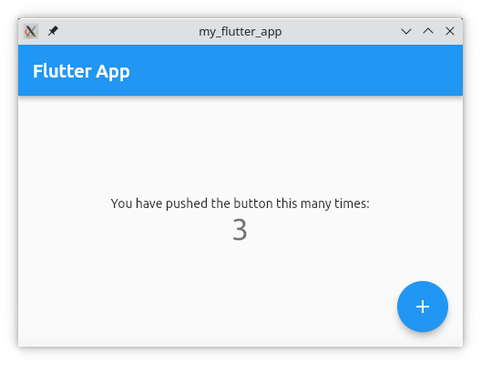

.. 18768.md

.. _flutter-applications:

Flutter applications
====================

`Flutter <https://flutter.dev/>`__ is Google’s open source toolkit for
creating applications for mobile, web and desktop platforms.

Snapcraft can be used to package and distribute Flutter applications in a
way that enables convenient installation by users.

The process of creating a snap for a Flutter application builds on standard
Flutter development and packaging tools, making it possible to adapt or
integrate an application's existing packaging into the snap building process.

Getting started
---------------

Snaps are defined in a single :file:`snapcraft.yaml` file placed in a
:file:`snap` folder at the root of your project. This YAML file describes
the application, its dependencies and how it should be built.

The following shows the relevant parts of the :file:`snapcraft.yaml` file for
a simple template project, `my-flutter-app`_:

.. code:: yaml

   name: my-flutter-app
   version: '1.0'
   summary: An example Flutter snap
   description: |
     An example showing how Flutter programs can be packaged as snaps.

   base: core22
   confinement: strict
   grade: stable

   apps:
     my-flutter-app:
       command: my_flutter_app
       extensions: [gnome]

   parts:
     my-flutter-app:
       source: .
       plugin: flutter
       flutter-target: lib/main.dart

We'll break this file down into its components in the following sections.

Metadata
~~~~~~~~

The :file:`snapcraft.yaml` file starts with a small amount of
human-readable metadata, which is often already available in the project's
own packaging metadata or :file:`README.md` file. This data is used in the
presentation of the application in the Snap Store.

.. code:: yaml

   name: my-flutter-app
   version: '1.0'
   summary: An example Flutter snap
   description: |
     An example showing how Flutter programs can be packaged as snaps.

The ``name`` must be unique in the Snap Store. Valid snap names consist of lower-case alphanumeric characters and hyphens. They cannot be all numbers and they also cannot start or end with a hyphen.

The ``version`` string can be an arbitrary version, such as ``1.0`` in our example, or keywords such as ``git``, to import a version string from a git tag or commit, for instance. Versions carry no semantic meaning in snaps.

The ``summary`` can not exceed 79 characters. You can use a chevron '>' in the
``description`` key to declare a multi-line description.

Base
~~~~

The base keyword declares which :term:`base snap` to use with the project.
A base snap is a special kind of snap that provides a run-time environment
alongside a minimal set of libraries that are common to most applications.

.. code:: yaml

   base: core22

In this example, `core22`_ is used as the base for snap building, and is based
on `Ubuntu 22.04 LTS`_. See :ref:`Base snaps <base-snaps>` for more details.

Security model
~~~~~~~~~~~~~~

Snaps are containerised to ensure more predictable application behaviour and
greater security. The general level of access a snap has to the user's system
depends on its level of confinement.

The next section of the :file:`snapcraft.yaml` file describes the level of
:term:`confinement` applied to the running application:

.. code:: yaml

   confinement: strict

It is usually best to start creating a snap with a confinement level that
provides warnings for confinement issues by specifying a ``confinement`` value of ``devmode``. In this example, the ``strict`` mode is used instead,
indicating that run-time confinement issues should not occur.

Specifying strict confinement enables the ``grade`` of the snap to be marked
as ``stable`` and published to a stable channel in the Snap Store.

Parts
~~~~~

Parts define what sources are needed to build your application. Parts can be
anything: programs, libraries, or other needed assets, but for this example,
we only need to use one part for the *my-flutter-app* source code:

.. code:: yaml

   parts:
     my-flutter-app:
       source: .
       plugin: flutter
       flutter-target: lib/main.dart

The ``source`` keyword points to the project source code, which can be a local
directory or remote Git repository. In this case, it refers to the main project
repository.

The ``plugin`` keyword is used to select a language or technology-specific
plugin that knows how to perform the build steps for the project.
In this example, the :ref:`flutter plugin <the-flutter-plugin>` is used to
build the project.

The ``flutter-target`` keyword is used to tell the plugin where the main
application code is located in the project.

Apps
~~~~

Apps are the commands and services that the snap provides to users. Each key
under ``apps`` is the name of a command or service that should be made
available on users' systems.

.. code:: yaml

   apps:
     my-flutter-app:
       command: my_flutter_app
       extensions: [gnome]

The ``command`` specifies the path to the application binary that the user
can run. This is resolved relative to the root of the snap contents.

If your command name matches the snap ``name``, users will be able run the command directly.

If the command name matches the name of the snap specified in the top-level
``name`` keyword (see `Metadata`_ above), the binary file will be given the
same name as the snap, as in this example.
If the names differ, the binary file name will be prefixed with the snap name
to avoid naming conflicts between installed snaps. An example of this would be
``my-flutter-app.some-command``.

The ``extensions`` keyword is used in this example to access GUI toolkit
features that the application needs. See :ref:`snapcraft-extensions` for
further details.

Building the snap
~~~~~~~~~~~~~~~~~

First, make sure you have installed :ref:`Snapcraft <snapcraft-overview>` and create a new directory for your Flutter project.

Inside that directory, type :command:`snapcraft init`. This creates an additional subdirectory, called :file:`snap` containing a template
:file:`snapcraft.yaml` file.

Edit the created :file:`snapcraft.yaml` to contain the Flutter example shown earlier.

After you've created the :file:`snapcraft.yaml`, you can build the snap by simply executing the :command:`snapcraft` command in the project directory:

.. code:: bash

   $ snapcraft
   Executed: pull gnome/sdk
   Executed: pull my-flutter-app
   Executed: build gnome/sdk
   Executed: build my-flutter-app
   Executed: stage gnome/sdk
   Executed: stage my-flutter-app
   Executed: prime gnome/sdk
   Executed: prime my-flutter-app
   Executed parts lifecycle
   Generated snap metadata
   Created snap package my-flutter-app_1.0_amd64.snap

The build process may take some time as both Flutter and the Dart SDK from Flutter are downloaded and installed into the build environment, but they won't be downloaded again with subsequent builds unless the environment is reset.

The resulting snap can be installed locally. This requires the ``--dangerous`` flag because the snap is not signed by the Snap Store, or if you're testing pre-confinement, the ``--devmode`` flag acknowledges that you are installing an unconfined application:

.. code:: bash

   sudo snap install my-flutter-app_1.0_amd64.snap --dangerous

You can then try it out:

.. code:: bash

   my-flutter-app

.. |execname| replace:: my-flutter-app
.. include:: common/removing-cleaning-snap.rst

.. Potentially just refer the reader to another tutorial.
.. include:: common/publishing-snap.rst

You now have a snap you can deploy and upload to the `Snap Store <https://snapcraft.io/store>`__. See :ref:`Releasing your app <releasing-your-app>` for more details, and to get a deeper insight into the snap building process, start with the :ref:`Snapcraft checklist <snapcraft-checklist>`.

.. _`my-flutter-app`: https://github.com/snapcraft-docs/my-flutter-app
